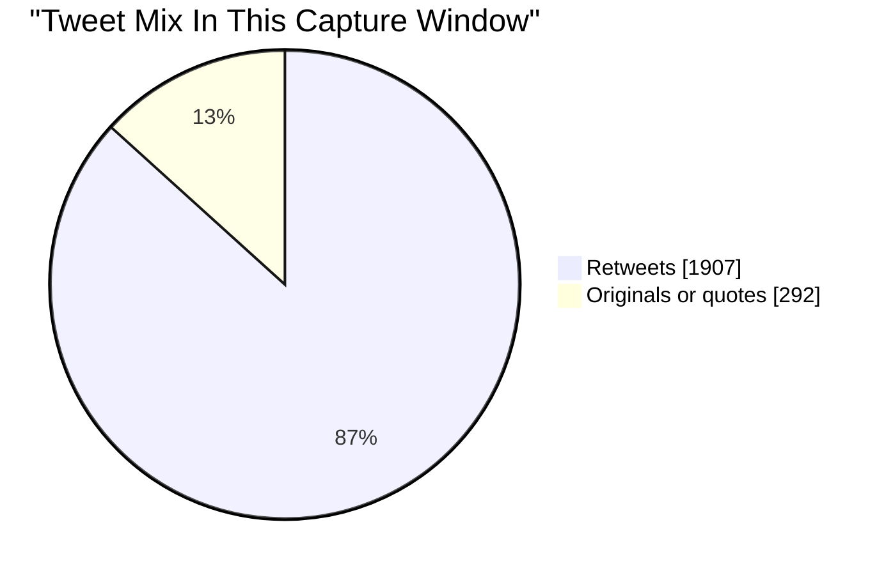
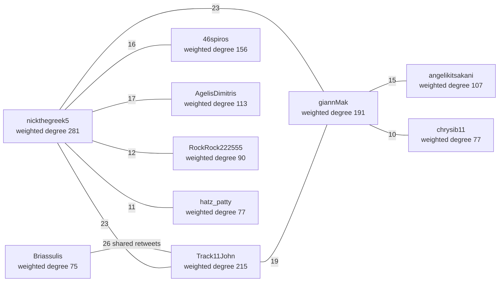
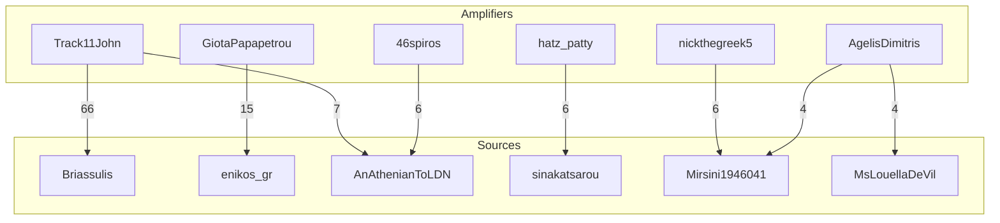
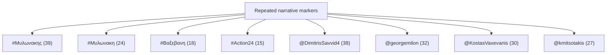

# Reanalysis Post-Mortem

## Scope

This note is for the run based on:

- `datasets-raw/twitter-ListMembers-1776293400829.csv`
- `datasets-raw/twitter-web-exporter-1776296731477.json`

Current sample:

- 604 listed accounts
- 2,199 tweet rows
- 197 active author handles
- 1,907 retweets
- 292 originals or quotes
- capture window from `2026-04-15T10:55:44+00:00` to `2026-04-15T23:36:58+00:00`

## What changed from v1

The first run already showed strong pair overlap, but the new exporter bundle changes the picture in a useful way:

- the overlap graph is no longer a small core plus a stray pair
- the current run resolves into one main connected component with 61 accounts, 283 edges, and 1,099 shared retweets
- the earlier pair view was directionally useful, but it understated the size of the cluster around `nickthegreek5`, `Track11John`, `giannMak`, `46spiros`, and `AgelisDimitris`

This is the main analytical lesson from the rerun: pair overlap is useful as an entrypoint, but the graph is the better unit of analysis.

## What worked

### 1. The network view exposed the actual cluster shape

The strongest single component is large enough to treat as a coordinated field rather than a set of unrelated pair coincidences.

Key node metrics:

- `nickthegreek5`: weighted degree `281`, neighbors `49`
- `Track11John`: weighted degree `215`, neighbors `34`
- `giannMak`: weighted degree `191`, neighbors `34`
- `46spiros`: weighted degree `156`, neighbors `33`
- `AgelisDimitris`: weighted degree `113`, neighbors `24`
- `angelikitsakani`: weighted degree `107`, neighbors `23`

This suggests a dense core with multiple high-overlap accounts, not a single dominant hub.

### 2. The rerun clarified source-amplifier relationships

Some accounts look more like heavy amplifiers than origin points.

Examples:

- `Track11John -> Briassulis`: `66`
- `GiotaPapapetrou -> enikos_gr`: `15`
- `Track11John -> elenasagiadinou`: `11`
- `46spiros -> AnAthenianToLDN`: `6`
- `hatz_patty -> sinakatsarou`: `6`
- `nickthegreek5 -> Mirsini1946041`: `6`

This is useful because overlap alone tells us who moves together, while retweeter-to-source edges tell us what they are moving.

### 3. Narrative concentration stayed narrow

The content layer is not evenly distributed. It clusters around a small number of hashtags and mention targets.

Top hashtags:

- `Μυλωνακης`: `39`
- `Μυλωνακη`: `24`
- `Βαξεβανη`: `18`
- `Action24`: `15`
- `PisoApoTisGrammes`: `10`

Top mentions:

- `@DimitrisSavvid4`: `38`
- `@georgemilon`: `32`
- `@KostasVaxevanis`: `30`
- `@kmitsotakis`: `27`

This matters because repeated retweet overlap and repeated narrative markers are reinforcing signals.

## What the current run says

### One dominant amplification field

The most practical reading of the current graph is:

- a dense center formed by `nickthegreek5`, `Track11John`, `giannMak`, `46spiros`, `AgelisDimitris`, and `angelikitsakani`
- a second ring of frequent but less central accounts such as `RockRock222555`, `hatz_patty`, `chrysib11`, `Briassulis`, `MenoEdo`, and `vythos70`
- repeated source concentration around a smaller set of authors and media accounts

### Strongest overlap edges

The top shared-retweet edges are:

- `Briassulis` + `Track11John`: `26`
- `Track11John` + `nickthegreek5`: `23`
- `giannMak` + `nickthegreek5`: `23`
- `Track11John` + `giannMak`: `19`
- `AgelisDimitris` + `nickthegreek5`: `17`
- `46spiros` + `nickthegreek5`: `16`
- `46spiros` + `Track11John`: `15`
- `angelikitsakani` + `giannMak`: `15`

These are not random edges at the margin of the graph. They are the main spine of the component.

### Repeated cascades

The largest cascades in this sample are:

- `dimitris7987`: `11`
- `zneraida`: `10`
- `AdonisGeorgiadi`: `10`
- another `AdonisGeorgiadi` original: `10`
- `ellada24`: `9`
- `Mirsini1946041`: `9`

This is not enough to claim automation. It is enough to say that the same field of accounts repeatedly converges on a limited set of originals.

## What is still missing

### 1. Lead-lag structure

The current run counts "first retweeter inside the sample", but it does not yet compute persistent lead-lag behavior across many cascades or days.

That means:

- we can see repeated early appearance
- we cannot yet say who systematically leads whom over time

### 2. Cross-day stability

This is still one capture window. The graph is large, but it is still a single-window graph.

What we still need:

- repeated exports across multiple days
- component stability checks
- edge persistence checks
- role persistence checks

### 3. URL, domain, and media reuse

This run is strong on retweet structure and narrative markers, but still weak on:

- URL reuse
- domain concentration
- media reuse
- quote-retweet framing

Those will make later reviews stronger.

## Mermaid views

### Tweet mix

### Core shared-retweet overlap graph

### Source-amplifier view

### Narrative concentration

## Analyst reading

If this run had to be summarized in one sentence, it would be:

One large overlap component dominates the captured sample, and its center is held together by repeated shared retweets, repeated source concentration, and repeated narrative markers.

A more careful version is:

- the current deterministic signals are strong enough to isolate a review-worthy network
- the graph has multiple central accounts rather than one obvious controller
- some accounts behave more like amplifiers
- some source accounts behave like recurrent content suppliers
- the content layer is narrow enough to suggest repeated campaign themes

## Limits and claim discipline

- This run is a coordination map, not a proof-of-bot report.
- "First retweeter" means first inside the captured sample, not first on the full platform.
- Missing member handles in the tweet data should be collected in the next round.
- No follower graph, no URL reuse layer, no media reuse layer, and no cross-day persistence layer are included yet.

## Immediate next steps

1. Add at least several more exporter bundles from different days.
2. Build lead-lag matrices from repeated cascades.
3. Add URL/domain extraction and media identifier reuse.
4. Build component profiles over time instead of one-window profiles only.
5. Start manual labels at the account and cascade level.
